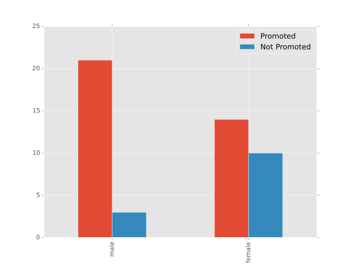
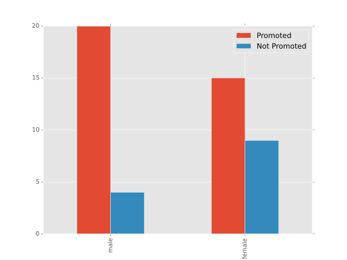

2.1 Gender Discrimination
=========================

.. code:: python

    RANDOM_SEED = 20151004
    random.seed(RANDOM_SEED)
    numpy.random.seed(RANDOM_SEED)
    matplotlib.style.use('ggplot')
    

Background
----------

The experiment is originally from [ISRSOPD]_ but is taken here from [ISWRS21]_.

In 1972 48 bank supervisors were asked to review a case file to decide if the person deserved a promotion. The managers were all male and the files were all identical but half the files were labeled male and half were labeled female.

Research Question
~~~~~~~~~~~~~~~~~

*Are females discriminated against in promotion decisions made by male managers?*

The Experiment Outcome
----------------------

Here I'll set up the data-frame using the values that were recorded in the experiment. I had a little bit of difficulty remembering how to set it up so I'll break it down a little.

Setting Up the Values
~~~~~~~~~~~~~~~~~~~~~

First I'll set up some constants to hopefully make it easier to remember what is being referenced.

.. '

.. code:: python

    GENDER_COUNT = 24
    MALES_PROMOTED = 21
    FEMALES_PROMOTED = 14
    TOTAL_PROMOTED = MALES_PROMOTED + FEMALES_PROMOTED
    GENDER_DIFFERENCE = MALES_PROMOTED - FEMALES_PROMOTED
    FEMALES_NOT_PROMOTED = GENDER_COUNT - FEMALES_PROMOTED
    MALES_NOT_PROMOTED = GENDER_COUNT - MALES_PROMOTED
    POINT_ESTIMATE = (MALES_PROMOTED-FEMALES_PROMOTED)/GENDER_COUNT

The DataFrame
~~~~~~~~~~~~~

Since I'm creating the frame from a dictionary the column-ordering isn't guaranteed so I'm explicitly listing the columns so that they'll be in the order I expect. You could also pass in the columns later on, if needed, but it seemed easier to do it here.

.. code:: python

    def create_frames(males_promoted, females_promoted):
        """
        Create a data frame to hold the experiment outcome
    
        :return: data-frame without totals, data-frame with totals
        """
        data = pandas.DataFrame({"Promoted": [males_promoted, females_promoted],
                                 "Not Promoted": [GENDER_COUNT-males_promoted,
                                                  GENDER_COUNT-females_promoted]},
                                index='male female'.split(),
                                columns=["Promoted", "Not Promoted"])
        frame = data.copy()
        frame['Total'] = sum((frame[column] for column in
                              frame.columns))
        last_row = pandas.DataFrame(frame.sum()).transpose()
        last_row.index = pandas.Index(['Total'])
        frame = pandas.concat((frame, last_row))
        return data, frame
    
    experiment_data, experiment_frame = create_frames(MALES_PROMOTED,
                                                      FEMALES_PROMOTED)

IndentOutput
~~~~~~~~~~~~

This is a class to help with creating tables from data frames.

.. code:: python

    class IndentOutput(object):
        """Fake file output for csv-writing """
        @classmethod
        def write(cls, line):
            """Write line to stdout with three spaces prepended"""
            sys.stdout.write("   {0}".format(line))
    

.. csv-table:: Experiment Outcome
   :header: ,Promoted,Not Promoted,Total

   male,21,3,24
   female,14,10,24
   Total,35,13,48

.. csv-table:: Experiment proportions
   :header: ,Promoted,Not Promoted,Total

   male,0.875,0.125,1.000
   female,0.583,0.417,1.000
   Total,0.729,0.271,1.000

Point Estimate
~~~~~~~~~~~~~~

Looking at the table of proportions shows that about 88% of the males were promoted while about 58% of the females were promoted. The difference in proportions of promotions is the point estimate for the population (the value that we will be testing).

.. code:: python

    def fraction(numerator, denominator):
        """
        :param:
         - `numerator`: value for the top of the fraction
         - `denominator`: value for the bottom of the fraction
        :return: latex fraction string
        """
        return r"\frac{{{0}}}{{{1}}}".format(numerator, denominator)
    

.. math::

   \frac{21}{24} - \frac{14}{24}&=\frac{7}{24}\\
   &\approx 0.292\\

Hypotheses
----------

Our **Null Hypothesis** is that there is no relationship between *gender* and *decision* (they are independent) while our **Alternative Hypothesis** is that there is a relationship and the observed difference of 29% would not likely happen by chance.

.. math::

   H_0 &: \textrm{The observed difference of 29% could have happened by chance, the variables are independent of each other.}\\
   H_A &: \textrm{The observed difference of 29% is not likely to have happened by chance and women are therefore less likely to be promoted than equally qualified men. }\\

Simulation
----------

Looking at the table above you can see that 35 files were given promotions while 13 weren't. The question is whether the difference in proportion of females and males that were promoted could have happened by chance, so the simulation involves creating stacks of 35 promoted and 13 not promoted with the genders randomly assigned to the files in each stack.

.. '

Procedure:

 #. Create 24 female files and 24 male files
 #. Create a promotion stack by randomly selecting 35 files without replacement
 #. Create a promotion stack from the remaining files
 #. Calculate the point estimate for this simulation

.. note:: This procedure is the way you could do it by hand, translating it to code introduces some changes.

Urn-Based
~~~~~~~~~

The following uses the idea of the *urn* (which I've seen in different books so it seems to be a standard idea).

.. '

.. code:: python

    females = [1] * GENDER_COUNT
    males = [0] * GENDER_COUNT
    urn = males + females
    promoted = random.sample(urn, TOTAL_PROMOTED)
    women_promoted = sum(promoted)
    men_promoted = TOTAL_PROMOTED - women_promoted
                                              
    simulation_data, simulation_frame = create_frames(men_promoted, women_promoted)

The outcome for this simulation.

.. csv-table:: Simulation Outcome
   :header: ,Promoted,Not Promoted,Total

   male,20,4,24
   female,15,9,24
   Total,35,13,48

.. math::

   \frac{20}{24} - \frac{15}{24}&=\frac{5}{24}\\
   &\approx 0.208\\

Interestingly, in this simulation women were promoted 20% less even though they were assigned to be promoted at random. Of course, one trial isn't enough to have any confidence with this simulation. To draw a conclusions I'll repeat it with more values.

The Real Simulation
-------------------

.. code:: python

    pickle = "simulation_differences.pkl"
    SIMULATION_COUNT = 100000
    if not os.path.exists(pickle):
        start = time.time()
        simulations = range(SIMULATION_COUNT)
        promotions = (random.sample(urn, TOTAL_PROMOTED) for simulation in simulations)
        differences = pandas.DataFrame({"Differences":[(TOTAL_PROMOTED - 2*sum(promoted))/GENDER_COUNT for promoted in promotions]})
        print("Simulation Time: {0} seconds".format(time.time() - start))
        differences.to_pickle(pickle)
    else:
        differences = pandas.read_pickle(pickle)

.. code::

    Simulation Time: 3.8610174655914307 seconds
    

.. code:: python

    differences.describe()
    

.. code:: python

    significant = differences[differences.Differences >= POINT_ESTIMATE]
    probability =
    len(significant.Differences)/len(differences.Differences)
    print(probability)
    

.. code::

    0.02472
    
    

Numpy Version
~~~~~~~~~~~~~

I'll also try to do this with numpy. The previous version seems to work well enough but I want to get more familiar with the numpy way. For some reason they don't have a simple way to create an array of samples without replacement (it works well with replacement) so there's still some looping that needs to be done.

.. '

.. currentmodule:: numpy.random
.. autosummary::
   :toctree: api

   choice

.. code:: python

    filename = "simulation_differences_numpy.pkl"
    if not os.path.exists(filename):
        start = time.time()
        simulations = range(SIMULATION_COUNT)
        promotions = (numpy.random.choice(urn, TOTAL_PROMOTED,
    replace=False) for simulation in simulations)
        differences = pandas.DataFrame({"Differences":[(TOTAL_PROMOTED -
    2*sum(promoted))/GENDER_COUNT for promoted in promotions]})
        print("Simulation Time: {0}".format(time.time() - start))
        differences.to_pickle(filename)
        significant = differences[differences.Differences >=
    POINT_ESTIMATE]
        probability =
    len(significant.Differences)/len(differences.Differences)
        print(probability)
    

.. code::

    Simulation Time: 5.316181182861328
    0.02366
    
    

